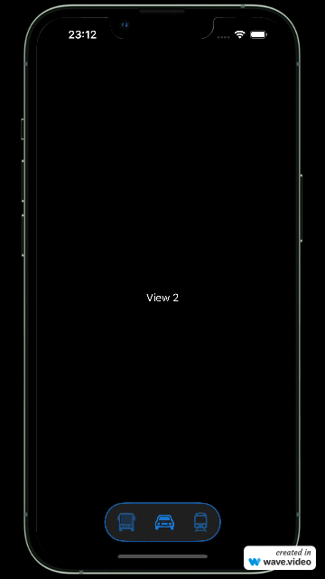

[](https://swiftpackageindex.com/bircni/BetterTabBar)
[](https://swiftpackageindex.com/bircni/BetterTabBar)
[](https://github.com/bircni/BetterTabBar/actions/workflows/swift.yml)

# BetterTabBar

Enhance your App with a better TabBar!

<p align="center">


## Installation

### Swift Package Manager

Add the following to your `Package.swift` file:

```swift
let package = Package(
    ...
    dependencies: [
        ...
        .package(name: "BetterTabBar", url: "https://github.com/bircni/BetterTabBar.git", from: "0.1.0"),
    ],
    targets: [
        .target(
            name: "MyApp",
            dependencies: ["BetterTabBar"] // Add as a dependency
        )
    ]
)
```

### Add package dependency in Xcode

Use this [guide](https://developer.apple.com/documentation/xcode/adding-package-dependencies-to-your-app) to add `BetterTabBar` to your project. Use <https://github.com/bircni/BetterTabBar> for the URL when Xcode asks.

## Usage

Use the Example in this repository as a starting point.

**Create a main View and add the `BetterTabBar`**

```Swift
import SwiftUI
import BetterTabBar

struct ContentView: View {
    @AppStorage("tabId") var tabId: Int = 0

    var body: some View {
        ZStack (alignment: .bottom){
            switch tabId {
            case 0:
                VStack {
                    Spacer()
                    Text("View 1")
                    Spacer()
                }
            case 1:
                VStack {
                    Spacer()
                    Text("View 2")
                    Spacer()
                }
            case 2:
                VStack {
                    Spacer()
                    Text("View 3")
                    Spacer()
                }
            case 3:
                VStack {
                    Spacer()
                    Text("View 1")
                    Spacer()
                }
            default:
                Text("View 1")
            }
            
            BetterTabBar(tabId: $tabId, strokeColor: .blue, strokeLineWidth: 2, spacing: 25, cornerRadius: 30, height: 60, tapFeedback: true, buttons: [
                TabButton(selectedImage: Image(systemName: "bus"), unselectedImage: Image(systemName: "bus.fill"), lightColor: .green, darkColor: .blue),
                TabButton(selectedImage: Image(systemName: "car"), unselectedImage: Image(systemName: "car.fill"), lightColor: .green, darkColor: .blue),
                TabButton(selectedImage: Image(systemName: "tram"), unselectedImage: Image(systemName: "tram.fill"), lightColor: .green, darkColor: .blue)
            ])
        }
    }
}
```

## Apps using BetterTabBar

- [ParkenUlm](https://apps.apple.com/de/app/id6447651336)
- [FuelLogger](https://apps.apple.com/app/id6449910025)
- [DUO](https://testflight.apple.com/join/0Sm4IXio)

## Contributing

Contributions are very welcome 🙌

To submit your changes, please open a Pull Request with a clear description of your changes.

## Contributors

<p align="center">
<a href="https://github.com/bircni/BetterTabBar/graphs/contributors">
  
</a>
</p>
